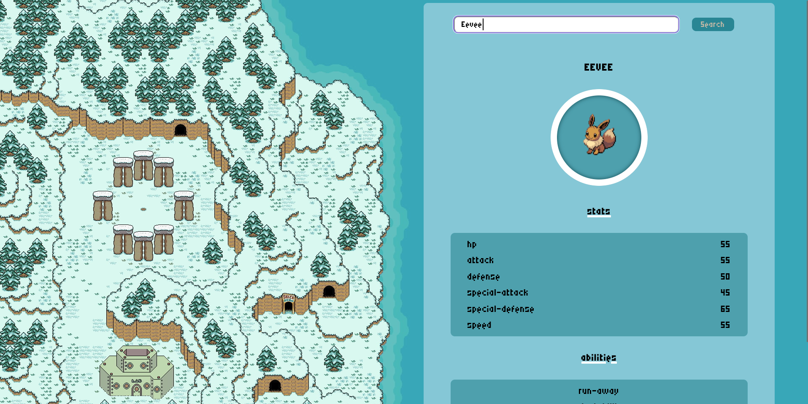
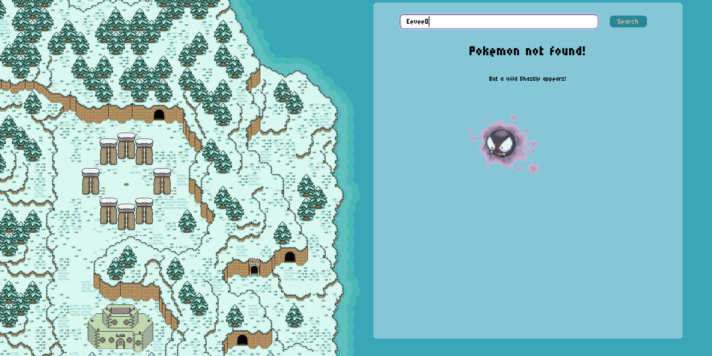
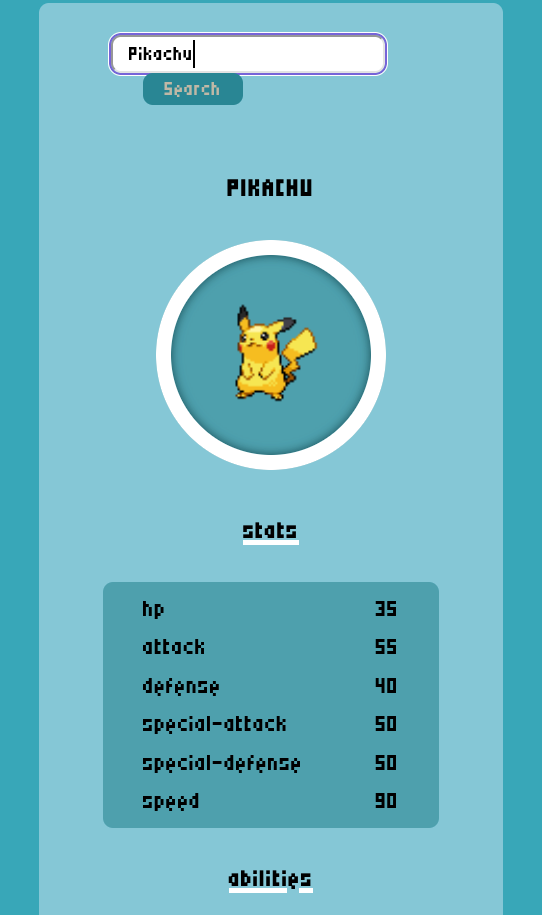

# Pokedex

## About The Project
This page intercepts the PokeApi and uses the data it receives to display in a ‘Pokedex’. 
  
The english name of one of the more than 1000 Pokemon can be entered in the input field. If you press Enter or the ‘Search’ button, a picture, the stats and the abilities of the Pokemon are displayed.
  
If the Pokemon cannot be found - because it does not exist or a spelling mistake has been made - a NotFound page will appear with a Ghastly, which will randomly appear on the page and disappear again. 
  
<a href="https://pokedex-dlii.onrender.com/">Viste the Pokedex on Render.com</a>

(<a href="#readme-top">back to top</a>)

## Roadmap:
The project is written using React.js. This library enabled me to create the Input, Pokemon and NotFound page in separate components and to design the page in an agile way. The context is used to keep the state of the pokemon up to date throughout the application.
  
The Pokedex has a media querie for mobil screens.  

(<a href="#readme-top">back to top</a>)

### Built With
This app is build with react.js, Vite, CSS and HTML. 

(<a href="#readme-top">back to top</a>)

### Screenshots

 
Landingpage
 
 

 
Search a Pokemon
 
 

 
Not Found
 
 
 
 
Mobile Version

(<a href="#readme-top">back to top</a>)

<!-- ROADMAP -->
<!-- ## Roadmap

(<a href="#readme-top">back to top</a>)

-->

<!-- CONTACT -->
## Contact

Judith Bohmann
  
Mail: ju.bohmann@gmx.de
  
Repo-Link: <a href="https://github.com/You-Did-Bowman/Pokedex">github.com/You-Did-Bowman/Pokedex</a>
  
Homepage: <a href="https://pokedex-dlii.onrender.com/">pokedex-dlii.onrender.com/</a>

(<a href="#readme-top">back to top</a>)
